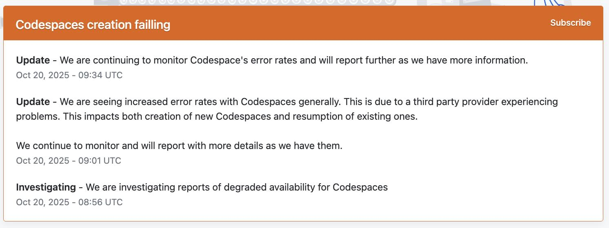
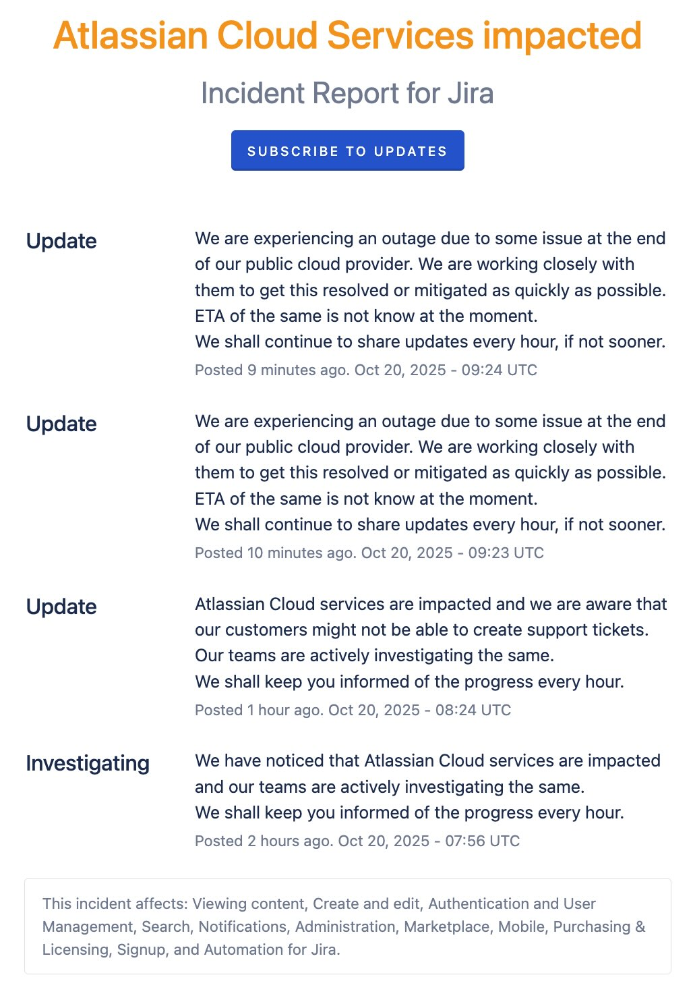
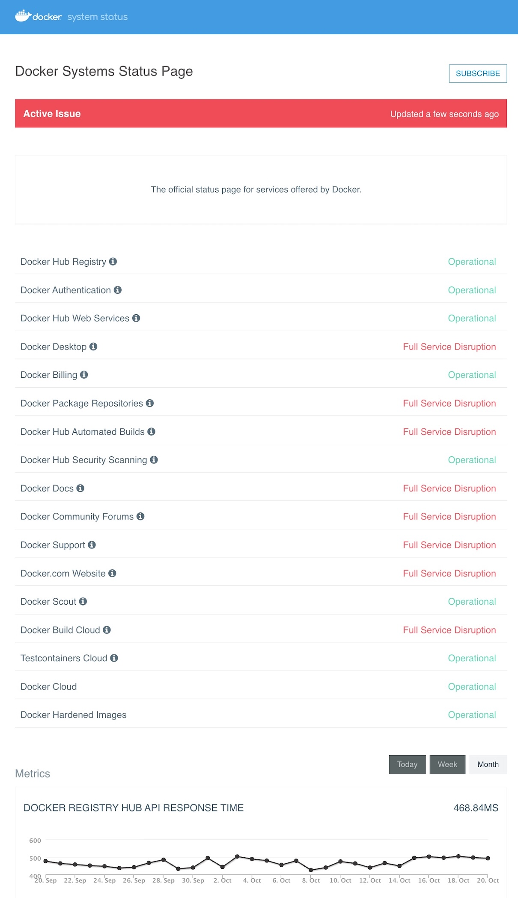

It's incredible how much we depend on AWS these days. So many services and products are built on top of its infrastructure, and today's outage was a stark reminder of that. Here's how it personally impacted my work:

1. **GitHub Actions – Builds**
    * My CI/CD pipelines were stuck, waiting for AWS to recover.
    * 

2. **Datadog**
    * Monitoring dashboards were down or lagging.
    * [Datadog Incident](https://status.datadoghq.com/incidents/ww8rhx2j8mfz)
    * 

3. **Slack**
    * Messaging was painfully slow, making team communication a challenge.
    * [Slack Status](https://slack-status.com/2025-10-20)

4. **Atlassian / Jira**
    * Issue tracking and project management were disrupted.
    * [Jira Incident](https://jira-software.status.atlassian.com/incidents/wh0w6jjt6g5l)
    * 

5. **Docker**
    * Pulling images and accessing Docker Hub was unreliable.
    * [Docker Status](https://www.dockerstatus.com/)
    * 

Honestly, it must have been a wild day to be the on-call engineer at AWS!

The funniest part? Today, several folks from Amazon visited us to promotion more of their services. They give away some promotional goodies like stickers and keychains, great timing!

By the way, here's the official AWS summary if you want to read more: [DynamoDB Service Disruption](https://aws.amazon.com/message/101925/).